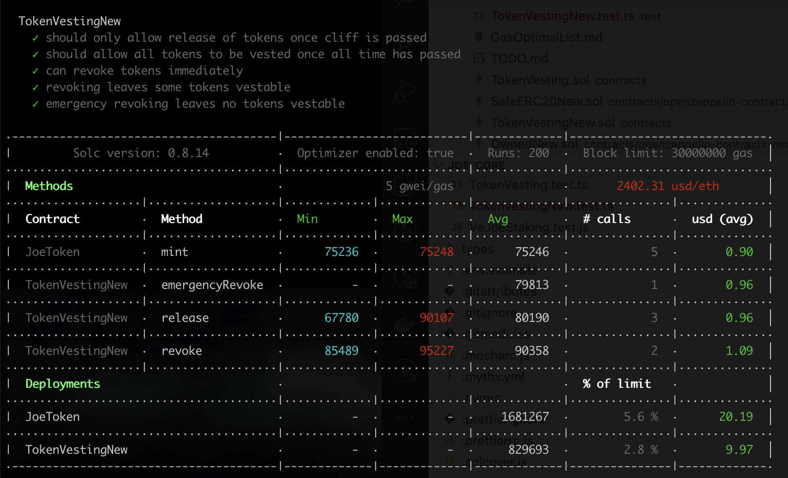
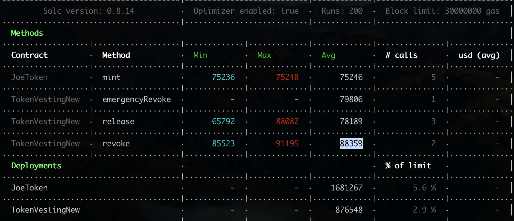

## GAS OPTIMAL LIST

0. For using new error feature, compiler was changed to 0.8.14
1. **Deployment gas cost vs Runtime gas cost**
    * For the TokenVestingNew contract, Although its main goal is to transfer token to one address, but no other infos shows all these functions will often uesd. Just ignore the solidity setting. Now `{ enabled: true, runs: 200 }.`

2. All error string changed to the custom error type meanwhile SafeERC20 and its related lib using latest version v5.0.0. 
    ```
    // custom error
    error InvalidZeroAddress(); // TokenVesting: beneficiary is the zero address

    error CliffBeyondDuration(); // "TokenVesting: cliff is longer than duration"

    error DurationIsZero();// duration is 0

    error FinalTimeBeyondCurTime(); // TokenVesting: final time is before current time"

    error NoUnreleasedToken(); // TokenVesting: no tokens are due
    
    error CannotRevoke();      //  TokenVesting: cannot revoke

    error AlreadyRevoked();  // token already revoked
    ```

3. Visibility 
    * public will automatically generate view query value funtion, which seems save deployed gas cost
    ```

     // beneficiary of tokens after they are released
    address private _beneficiary;                               =>  address public immutable _beneficiary;

    // Durations and timestamps are expressed in UNIX time, the same units as block.timestamp.
    uint256 private _cliff;                                     => uint256 public _cliff;
    uint256 private _start;                                     => uint256 public _start;
    uint256 private _duration;                                  => uint256 public _duration;

    bool private _revocable;                                    => uint256 public _revocable;
    ```

**Gas Cost Beginning**


**Gas Cost build on above change**

 
 **Gas cost for All functions(TokenVestingNew) and deployed  have reduced**


 
4. For storing timestamp changing uint256 to uint64, which is enough. meanwhile add unchecked for _cliff = start + cliffDuration;
```
    uint256 private _cliff;
    uint256 private _start;
    uint256 private _duration;
    ======>
    uint64 public _cliff;
    uint64 public _start;
    uint64 public _duration;

    unchecked {_cliff = start + cliffDuration;}


```

4. add payable

```
    TokenVestingNew constructor add payable

    function emergencyRevoke(IERC20 token) external payable onlyOwner {
    function revoke(IERC20 token) external payable onlyOwner {

```

**Gas Cost V2 build on above change**

 
 **Except deployment gas cost increased,  gas cost for all functions(TokenVestingNew) decreased**

5. Assembly tricks. Can also apply assembly when revert customer error and emit event. but for code readable, just ignore.


## Problems
1. Uint test doesn't cover al all cases.


SafeERC20New, which inculdes permit function that can reduce the  fees when transfer erc20 token to this address

