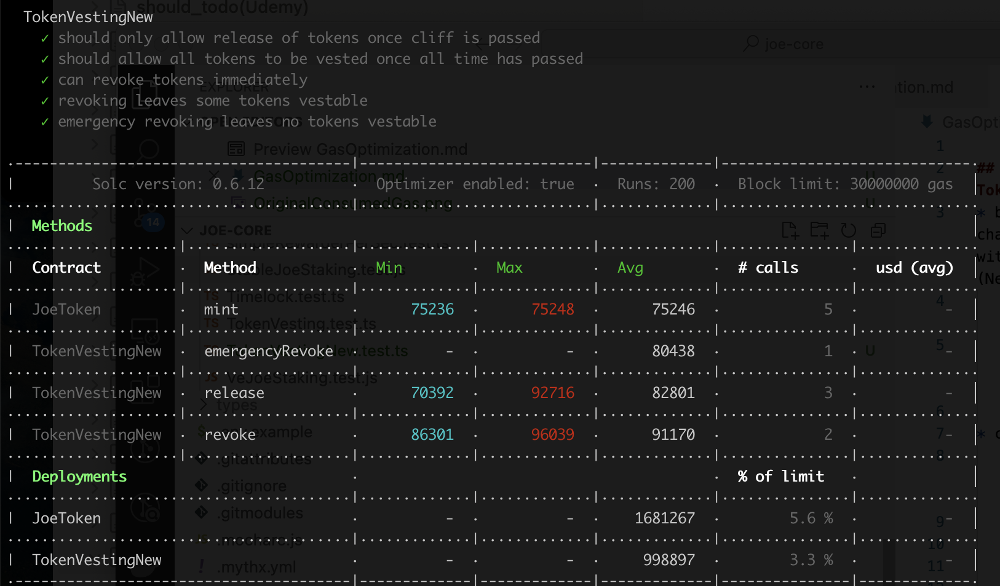

## TARGET SMART CONTRACT
*  [TokenVestingNew](contracts/TokenVestingNew.sol) based on [TokenVesting](contracts/TokenVesting.sol)
*  yarn test:gas test/TokenVestingNew.test.ts  [TokenVestingNew.test.ts](test/TokenVestingNew.test.ts)
## CHANGED POINTS FOR CONVERTING COMPILER VERSION 
1. solidity compiler chaning from ^0.6.0 to ^0.8.0
2. Using a new version of Ownable, SafeERC20, which is OpenZeppelin Contracts v4.4.1
3. delete SafeMath,TokenVesting => TokenVestingNew

## ENVIRONMENT INFO
* evm version istanbul
* solidity compiler 0.8.0 config `{ enabled: true, runs: 200 }.`

## PROTOCOL INTRODUCTION

## GAS COST(CURRENT)
* OriginalConsumedGas

## GAS COST(AFTER OPTIMISING)

## GAS OPTIMAL LIST

## PROTOCOL MATERIALS
1. based on below commit hash: 
    * https://github.com/traderjoe-xyz/joe-core 5bec2f3d86500bfd81038c99afe702ee7e67af3e
2. [Offical web](https://traderjoexyz.com/)
3. on-chain address   https://github.com/traderjoe-xyz/joe-core/tree/5bec2f3d86500bfd81038c99afe702ee7e67af3e/deployments todo
    * ethereeum no address?

