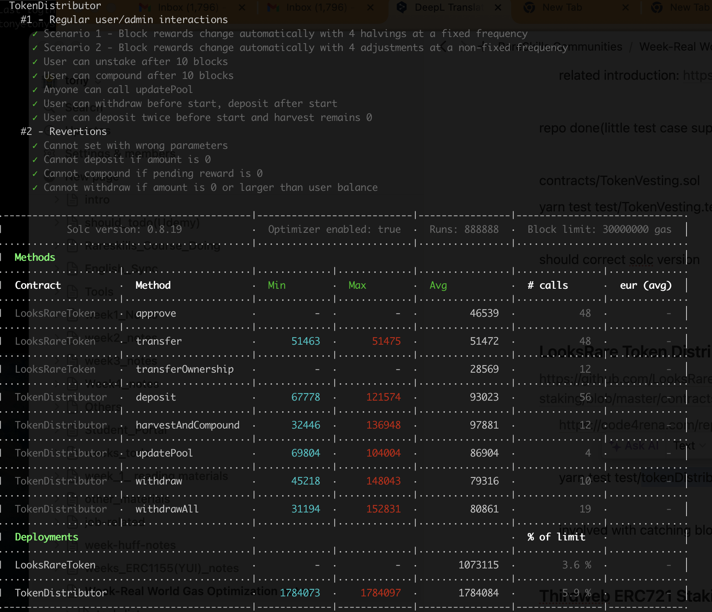

## GAS OPTIMAL LIST

1. Deployment gas cost vs Runtime gas cost

   - This contract has consider the runtime gas cost thoroughly as the setting `{ enabled: true, runs: 888888 }.`

2. Error string changed to the custom error type meanwhile SafeERC20 and its related lib using latest version v5.0.0.

   ```
   Except below error msg, others was changed to custom error.Because the blew are short-circuit booleans
   require(
            (userInfo[msg.sender].amount >= amount) && (amount > 0),
            "Withdraw: Amount must be > 0 or lower than user balance"
        );

   require(
            (_periodLengthesInBlocks.length == _numberPeriods) &&
                (_rewardsPerBlockForStaking.length == _numberPeriods) &&
                (_rewardsPerBlockForStaking.length == _numberPeriods),
            "Distributor: Lengthes must match numberPeriods"
        );

   ```

3. ReentrancyGuardNew,SafeERC20New which uses the latest practices. This new practices have used the custom error.

**Gas Cost Beginning**


**Gas Cost build on above change**


**Excpet harvestAndCompound/updatePool Gas cost for other functions and deployed have reduced**

3. Optimize looping funcitons and add payable in constuctor, whihc decreased deploy gas cost

```
do {
            amountTokensToBeMinted +=
                (_rewardsPerBlockForStaking[i] * _periodLengthesInBlocks[i]) +
                (_rewardsPerBlockForOthers[i] * _periodLengthesInBlocks[i]);

            stakingPeriod[i] = StakingPeriod({
                rewardPerBlockForStaking: _rewardsPerBlockForStaking[i],
                rewardPerBlockForOthers: _rewardsPerBlockForOthers[i],
                periodLengthInBlock: _periodLengthesInBlocks[i]
            });

            unchecked {
                ++i;
            }
        } while (i < _numberPeriods);

```

4.  withdrawAll, cache userInfo[msg.sender].amount
    **Gas Cost build on above change**
    
    **Excpet harvestAndCompound, Gas cost for other functions and deployed have reduced**

5.  Assembly tricks. Can also apply assembly when revert customer error and emit event. but for code readable and for my trying which seems not 100% percent decreasing gas cost, just ignore.

Lookes rare as ERC20 token, can implemment ERC20Permit, save gas for user

