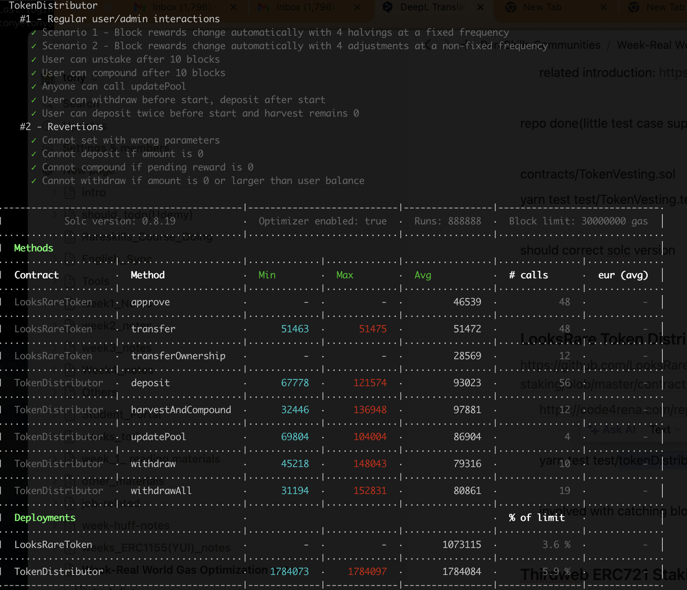
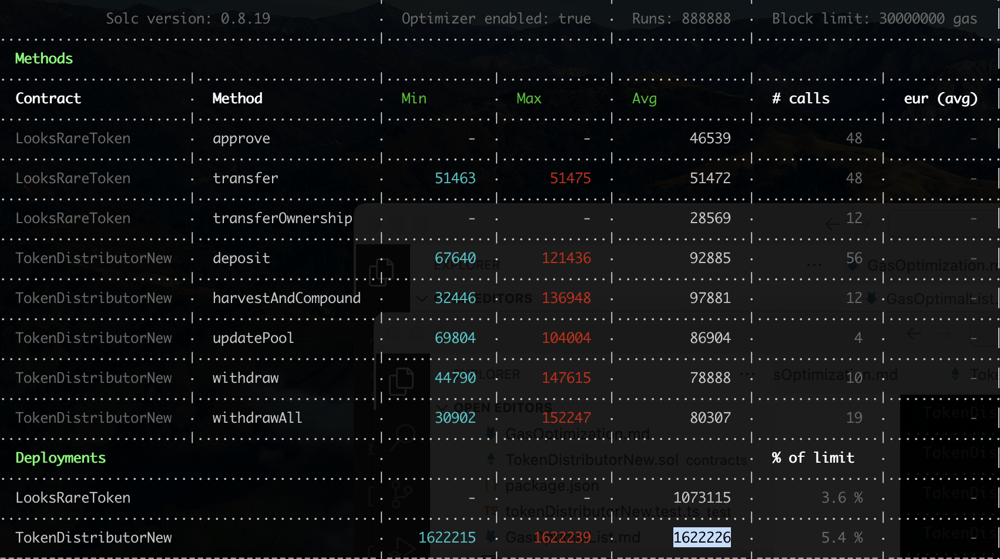

## TARGET SMART CONTRACT

- [TokenDistributorNew](contracts/TokenDistributorNew.sol) copy [TokenDistributor](contracts/TokenDistributor.sol)
- test file
  - yarn test:gas test/tokenDistributorNew.test.ts
  - [tokenDistributorNew.test.ts](test/tokenDistributorNew.test.ts) copy [tokenDistributor.test.ts](test/tokenDistributor.test.ts)

## ENVIRONMENT INFO

- evm version london
- solidity compiler 0.8.19 config `{ enabled: true, runs: 888888 }.`

## PROTOCOL INTRODUCTION

- LooksRare is an NFT marketplace, also has some on-chain games.

- For the tokenDistributor contract, which decides the LOOKS token's emission, either for staking or mint the LOOKS token to the TokenSplitter address.

- tokenDistributor contract's related contracts as below
  1. Depend on which contracts
  - Safe or Privilege management. ReentrancyGuard,SafeERC20
  - ILooksRareToken: the LooksRareToken,
  - tokenSplitter: tokenRewardForOthers(team + treasury + trading rewards)
  2. Which contracts depend on tokenDistributor?
  - FeeSharingSystem
    > This smart contract is an additional layer on top of the TokenDistributor contract, which also unlocks WETH rewards, stemming from the LooksRare exchange's protocol fee collected at every trade.
  - FeeSharingSetter
  - StakingPoolForUniswapV2Tokens
- The core feature or the core desgin as below in a nutshell

  1. **How to track each staker's rewards**

  - Calculating user's rewards by accTokenPerShare and rewardDebt, like synx

  2. **How to set the rewards?**

  - Unlike synx configing the rewardsInfo by other contract,LOOKS mint the rewards token by itself, and the rewards config more flexible
  - Also including other type rewards: rewardPerBlockForOthers, which target for (team + treasury + trading rewards)

  3. **The differenes comparing synx**

  - Based on block, not timestamp
  - Rewards config more flexible,such as each staking period can have different blocks.
  - Has auto-compounding
- [TokenDistributorImplementation notes](TokenDistributorImplementation.md)

**Reference**

- As Looks website explain
  > The design of the smart contracts relies greatly on the previous work and algorithms developed by leading DeFi protocols, specifically Synthetix (SIP-63), SushiSwap (MasterChef), and Yearn (auto-compounding strategies).
  > Reference:

* [staking-algorithm](https://www.rareskills.io/post/staking-algorithm)

* [looksrare-token-staking-overview](https://docs.looksrare.org/developers/looksrare-token-staking-overview)

## GAS COST(CURRENT)

- OriginalConsumedGas to check again
  

## GAS COST(AFTER OPTIMISING)


## GAS OPTIMAL LIST
[GasOptimizationList](GasOptimalList.md)

## PROTOCOL MATERIALS

1. based on below commit hash: -https://github.com/LooksRare/contracts-token-staking 0f9e092e619131cd42be90b3b7b9a8e31880ceda
2. [Offical web](https://looksrare.org/)
3. onchain address https://docs.looksrare.org/developers/deployed 
   - developer doc https://docs.looksrare.org/developers/welcome


https://etherscan.io/address/0x465A790B428268196865a3AE2648481ad7e0d3b1

## Question

```
  // below : which potential issues?
  // It allows protection against potential issues to prevent funds from being locked
  // todo check WHY???
bool mintStatus = looksRareToken.mint(address(this), tokenRewardForStaking);
```