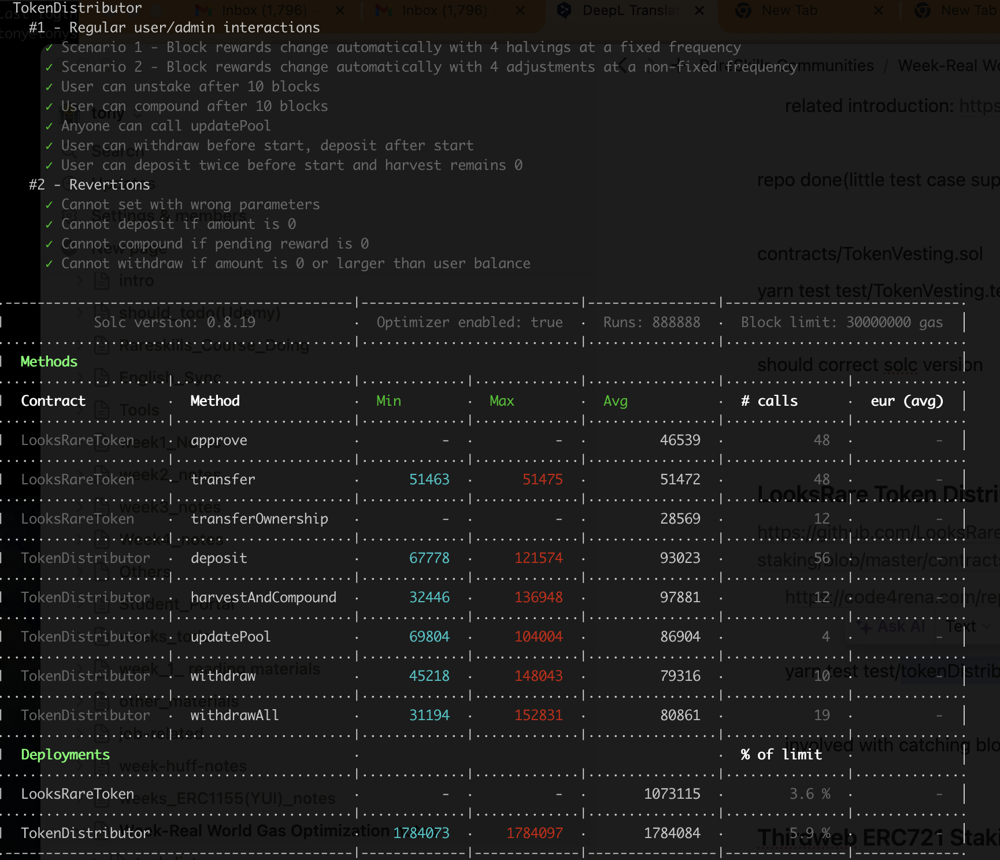

## Target Smart contract tokenDistributor

- Test file
  - yarn test test/tokenDistributor.test.ts
- compiler

  1. version ^0.8.0
  2. Actually set

  ```
  compilers: [
      {
        version: "0.8.19",
        settings: { optimizer: { enabled: true, runs: 888888 } },
      },
  ```

- OriginalConsumedGas
  

## Project Info

- 0f9e092e619131cd42be90b3b7b9a8e31880ceda https://github.com/LooksRare/contracts-token-staking
- offical web https://looksrare.org/
- developer doc https://docs.looksrare.org/developers/welcome
  - https://docs.looksrare.org/developers/deployed-contract-addresses
