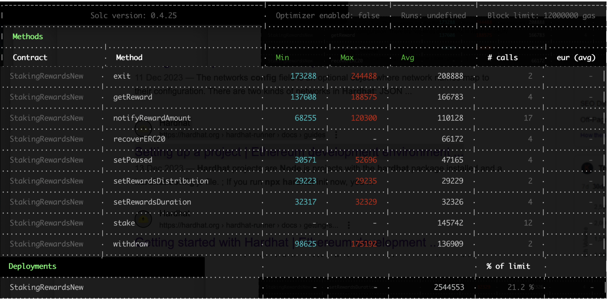

## TARGET SMART CONTRACT
*  [StakingRewardsNew](contracts/StakingRewardsNew.sol) based on [StakingRewards](contracts/StakingRewards.sol)
*  test file
    * REPORT_GAS=true npx hardhat test test/contracts/StakingRewardsNew.js
    * [StakingRewardsNew.js](test/contracts/StakingRewardsNew.js)
## CHANGED POINTS FOR CONVERTING COMPILER VERSION 
* [changed points](./AdjustCompilerVersion.md) 

## ENVIRONMENT INFO
* evm version london
* solidity compiler 0.8.14 set `{ enabled: true, runs: 200 }.`

## PROTOCOL INTRODUCTION
* As protocol's intro, Synthetix is a crypto-backed synthetic asset platform. Core Token is SNX(SNX holders can stake SNX to issue Synths, on-chain synthetic assets). Support two types token,Perpetual Futures,Spot Synths.

* For StakingRewards contract, user can stake the stakingToken, then can get the rewardsToken. Both  stakingToken and rewardsToken are ERC20 token, stakingToken can iBTC, or iETH...,rewardsToken is SNX. But for now(20231228) the activities involved with the corrospending's contract is very low. [addresses.md](https://github.com/Synthetixio/synthetix-docs/blob/master/content/addresses.md)

* StakingRewards Contract based on the below contracts
    1. StakingRewards, basic function stake,withdraw,getRewards
    2. Safe or Privilege management. Pausable,ReentrancyGuard,SafeERC20
    3. Rewards management, which was controlled by the RewardsDistribution.

* The core feature or the core desgin is how to track each user's rewards,how to update the rewards's info? Who can edit the rewards info and add the rewards to the StakingReward contract.
    * **Briefly, each time the user interact(stake,withdraw,getRewards) with contract, the user's rewards info will updates.**
    * **rewardPerTokenStored records the accumulated rewards per staking Token, Calcuating the user's rewards by rewardPerTokenStored and userRewardPerTokenPaid.** 
    * **RewardsDistribution contract can edit rewards Info, and will call StakingReward's notifyRewardAmount function while executing distributeRewards, meanwhile stakingToken's rewards info is updating.** 
    * More details can see [staking-algorithm](https://www.rareskills.io/post/staking-algorithm)

## GAS COST(CURRENT)
- OriginalConsumedGas
  * ***As StakingRewardsNew based on many contracts(I have delete these contracts in the blew table) which use another compiler version(0.5.16), the blew compiler version shows 0.8.14, but the optimizer setting{ enabled: true, runs: 200 } doesn't show.  perhaps there are some compitable problem with these. The blew just give rough estimatation***
  

## GAS COST(AFTER OPTIMISING)

## GAS OPTIMAL LIST

## GAS OPTIMAL LIST

Some considerations
* deployment 
bytecode size
12055
deployedBytecode size
10841

## PROTOCOL MATERIALS

1. based on below commit hash: 
    * https://github.com/Synthetixio/synthetix/tree/develop 365764b265a2ee2f55d08d5d3147a6ece0224cfe
2. [Offical web](https://synthetix.io/)
3. on-chain address 
    * [addresses.md](https://github.com/Synthetixio/synthetix-docs/blob/master/content/addresses.md)
    * [StakingRewardsiBTC on-chain(Ethereum) address]( https://etherscan.io/address/0x167009dcDA2e49930a71712D956f02cc980DcC1b#code) 

3. dune
https://dune.com/synthetix_community/synthetix-stats