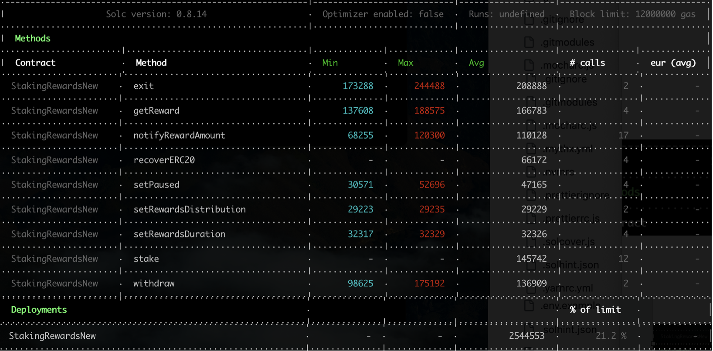

## TARGET SMART CONTRACT
*  [StakingRewardsNew](contracts/StakingRewardsNew.sol) based on [StakingRewards](contracts/StakingRewards.sol)

## CHANGED POINTS FOR CONVERTING COMPILER VERSION 
* [changed points](./AdjustCompilerVersion.md) 

## ENVIRONMENT INFO
* evm version london
* solidity compiler 0.8.14 set `{ enabled: true, runs: 200 }.`

## PROTOCOL INTRODUCTION

## GAS COST(CURRENT)
- OriginalConsumedGas to check again (StakingRewardsNew using ^0.8.0, others not using )
  

## GAS COST(AFTER OPTIMISING)

## GAS OPTIMAL LIST

## PROTOCOL MATERIALS

1. based on below commit hash: 
    * https://github.com/Synthetixio/synthetix/tree/develop 365764b265a2ee2f55d08d5d3147a6ece0224cfe
2. [Offical web](https://synthetix.io/)
3. on-chain address 
    * [addresses.md](https://github.com/Synthetixio/synthetix-docs/blob/master/content/addresses.md)
    * [StakingRewardsiBTC on-chain(Ethereum) address]( https://etherscan.io/address/0x167009dcDA2e49930a71712D956f02cc980DcC1b#code) 

