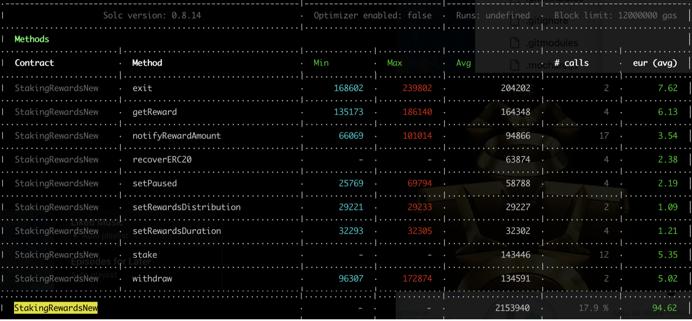
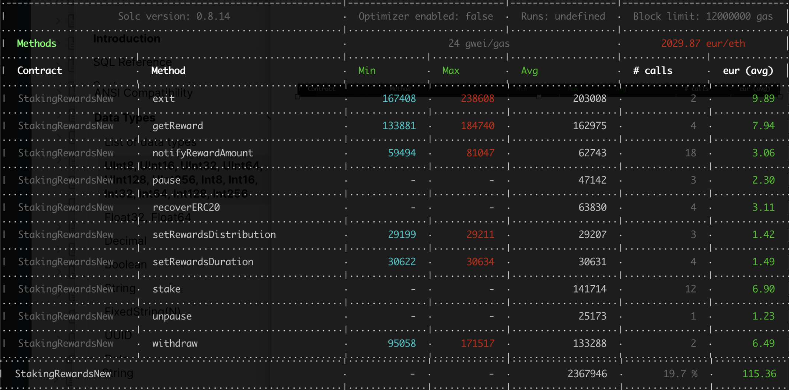
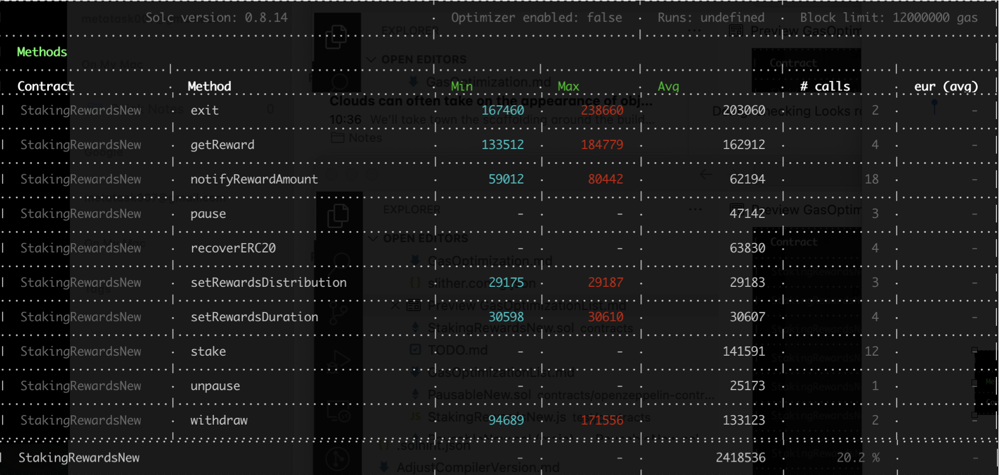

## GasOptimizationList

1. **Deployment gas cost vs Runtime gas cost**
    * For the StakingRewards contract's main goal is user will frequently interacting with this contract, So should put more attention on running time Optimization. Now using the defalue setting `runs: 200 `. So can improve this number to save more gas while user interacting with this contract. Reference:[smart-contract-creation-cost](https://www.rareskills.io/post/smart-contract-creation-cost)

2. All error string were changed to the custom error type meanwhile SafeERC20 using latest version v5.0.0. 
    * memory just using 32 bytes, TODO when add param ？？？
    ** comparing customError, seems sometimes its's more readable for using long error message.
    ```
    /* ========== CUSTOMER ERROR ========== */
    error StakeAmountMustGTZero();

    error WithDrawAmountMustGTZero();

    error ProvidedRewardTooHigh();

    error UnableWithDarawStakingToken();

    error PreviousRewardsShouldDoneBeforeChangDuration();
    
    ```

3. Visibility and init value check
 ```solidity
    IERC20 public rewardsToken;               => IERC20 public immutable  rewardsToken; 
    IERC20 public stakingToken;               => IERC20 public immutable  stakingToken;
    uint256 public periodFinish= 0;          => uint256 public periodFinish;          
    uint256 public rewardRate = 0;            => uint256 public rewardRate = 1; //from non-zero =>non-zero which save more gas than from zero=>non-zero. but which seems make the code less readable 
    uint256 public rewardsDuration = 7 days; 
    uint256 public lastUpdateTime;            => uint256 private lastUpdateTime;
    uint256 public rewardPerTokenStored;      => uint256 private rewardPerTokenStored;

 ```
 
 4. Most depended lib has used the latest pratice, such as ReentrancyGuardNew

 ```solidity
 ReentrancyGuardNew
     uint256 private constant _NOT_ENTERED = 1;
     uint256 private constant _ENTERED = 2;

      uint256 private _status = _NOT_ENTERED;
 ```

5. make constructors payable, which save deployment gas cost

**Gas Cost Beginning**


**Gas Cost optimiation v1 build on above change**


**Except SetPaused(as add param for custom error) Gas cost for All function and deployed  have reduced**
* bbff549f3399dfe16d7da4699150bea2a7171bae commit hash


6. add unchecked, other points related the arithmetic operations maybe can add unchecked, but for the code reaable, just ignore

```
    uint256 remaining = periodFinish - block.timestamp;  ==> uint256 remaining = unchecked{ periodFinish - block.timestamp;}

```
7. For the blocktime changing from  uint256 to uint64, uint64 is enough for recording date
```
    uint256 public  periodFinish;                  
    uint256 public  rewardRate = 1;
    uint256 public  rewardsDuration = 7 days;     
    uint256 private lastUpdateTime;

    =====>
    uint256 public  rewardRate = 1;
    uint64 public  periodFinish;
    uint64 public  rewardsDuration = 7 days;

    uint64 private lastUpdateTime;
    uint256 private rewardPerTokenStored;

```
plus:PausableNew using openzepplin latest version


**Gas Cost optimiation v2 build on above change**

    * **Most functions's gas cost have reduced, except deploy cost increased, which perhaps caused by using the new PausableNew***
    * 2beacc50961de083547d73fb3a548a8e2f957a85 commit hash
    

8. admin funtion add payable 
```
StakingRewardsNew
    setRewardsDuration
    recoverERC20


RewardsDistributionRecipientNew
    function setRewardsDistribution(address _rewardsDistribution) external payable onlyOwner {

```

9. cache periodFinish,rewardsDuration
```
uint64 _periodFinish = periodFinish; // cache periodFinish
uint64 _rewardsDuration = rewardsDuration;
```
**Gas Cost optimiation v3 build on above change**

     **except deploy and exit funcition gas cost increased,pause、unpause、recoverERC20 keep same, the gas cost for other functions have reduced** 
    

10. Assembly tricks try. using assembly revert customer error, only save tiny gas meanwhile using log which have increased the gas cost, and considering the code readable, just ignore. 

```
    // 141591 => 141585  
    //   if(amount == 0){
    //         revert StakeAmountMustGTZero();
    //     } 
    
    assembly{
            if iszero(amount){
                mstore(0x00,0xbdfa336600000000000000000000000000000000000000000000000000000000) //0xbdfa3366
                revert(0x00,0x04)  
            }
        }

```


ProxyERC20, wich creat the staking ERC20 token, can using ERC20 ERC20Permit, save gas for user.

    
    


