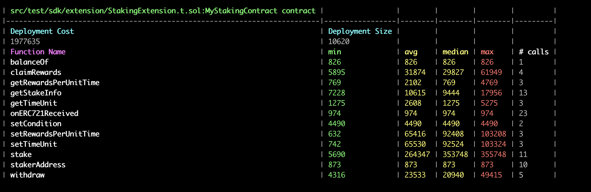

## TARGET SMART CONTRACT
*  [Staking721.sol](contracts/extension/Staking721.sol)
*  forge gas test --mc StakingExtensionTest TODO CHECK   [StakingExtension.t.sol](./src/test/sdk/extension/StakingExtension.t.sol)

## ENVIRONMENT INFO
* evm version london
* solidity compiler 0.8.23 config `{ enabled: true, runs: 20 }.`

## PROTOCOL INTRODUCTION

## GAS COST(CURRENT)
- OriginalConsumedGas
  

## GAS COST(AFTER OPTIMISING)

## GAS OPTIMAL LIST

## PROTOCOL MATERIALS
1. based on below commit hash: 
    *   https://github.com/thirdweb-dev/contracts 9d33ac18a61cf84e165c83aa2bc596e80a8379a2
2. [Offical web](https://portal.thirdweb.com/contracts)
3. [Staking721](contracts/extension/Staking721.sol)
    * https://portal.thirdweb.com/solidity/extensions/erc721staking
    * https://portal.thirdweb.com/solidity/base-contracts/staking/staking721base
    

