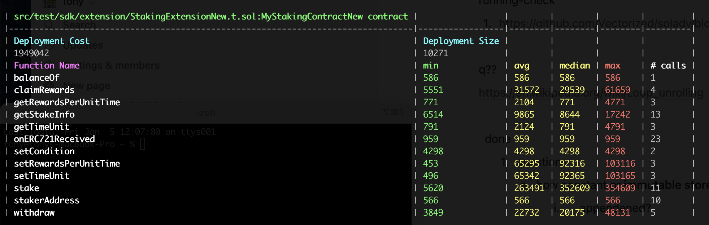
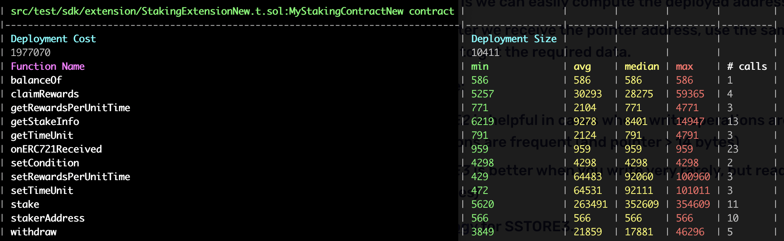

## GAS OPTIMAL LIST

1. **Deployment gas cost vs Runtime gas cost**
    * For the Staking721New contract, the user should interact with contract should more frequently, at least much greater than 20. So just changed it to   `{ enabled: true, runs: 200 }.`

2. All error string were changed to the custom error type meanwhile ReentrancyGuard using new version, visibility for stakingToken add immutable.
    
    ```
    // error
    error ZeroAddressForStakingToken(); // "collection address 0"

    error UnAuthorized();               // Not authorized

    error TimeUnitUnchanged();          // Time-unit unchanged 
    
    error RewardUnchanged();            // Reward unchanged

    error StakingZeroTokens();          //  "Staking 0 tokens"

    error WithdrawingZeroTokens();      // Withdrawing 0 tokens
    
    error WithdrawingMoreThanStaked(); // Withdrawing more than staked

    error NotStaker();                  // Not staker

    error NoRewards();                  // No rewards

    error ZeroTimeUint();               // time-unit can't be 0


    address public stakingToken;        ==> address public immutable stakingToken; 
    
    ```   

**Gas Cost Beginning**
 ***Not including balanceOf() / setCondition()***


**Gas Cost v1 build on above change**

 
 **Gas cost for All functions and deployed  have reduced**

3.Change how to looping，such as below

```
     for (uint256 i = 0; i < len; ++i) {
            isStaking = 2;
            IERC721(_stakingToken).safeTransferFrom(_stakeMsgSender(), address(this), _tokenIds[i]);
            isStaking = 1;

            stakerAddress[_tokenIds[i]] = _stakeMsgSender();

            if (!isIndexed[_tokenIds[i]]) {
                isIndexed[_tokenIds[i]] = true;
                indexedTokens.push(_tokenIds[i]);
            }
        }
    ==========》
    uint256 i;
        do{
            isStaking = 2;
            IERC721(_stakingToken).safeTransferFrom(_stakeMsgSender(), address(this), _tokenIds[i]);
            isStaking = 1;

            stakerAddress[_tokenIds[i]] = _stakeMsgSender();

            if (!isIndexed[_tokenIds[i]]) {
                isIndexed[_tokenIds[i]] = true;
                indexedTokens.push(_tokenIds[i]);
            }
            unchecked{++i;}

        }while(i < len);
    
```

4. init value

```
    uint64 private nextConditionId; ==>uint64 private nextConditionId = 1;

```


 **Gas Cost v2 build on above change**

 ***claimRewards()/getStakeInfo() and deployed gas cost ***

4.  add payable

```
  Staking721New constructor add payable

  function setTimeUnit(uint256 _timeUnit) external payable virtual {
  function setRewardsPerUnitTime(uint256 _rewardsPerUnitTime) external payable virtual {
```

5. Using storage pointers instead of memory. reference [Use storage pointers instead of memory where appropriate](https://www.rareskills.io/post/gas-optimization#viewer-7stcj)
```
    _calculateRewards
        Staker memory staker = stakers[_staker]; ==> Staker storage staker = stakers[_staker];
        StakingCondition memory condition = stakingConditions[i];  ==> StakingCondition memory  condition = stakingConditions[i];
    
    setTimeUnit
        StakingCondition memory condition = stakingConditions[nextConditionId - 1]; ==》StakingCondition storage condition = stakingConditions[nextConditionId - 1];

    setRewardsPerUnitTime
        StakingCondition memory condition = stakingConditions[nextConditionId - 1]; ==》 StakingCondition storage condition = stakingConditions[nextConditionId - 1];
```
 **Gas Cost v3 build on above change**

 ***Although depploy gas cost increased, claimRewards /getStakeInfo /setRewardsPerUnitTime gas cost reduced***

6. Assembly tricks. Can also apply assembly when revert customer error and emit event. but for code readable, just ignore.

 

As seems the Staking721New(template contract) contract will be used more times, so it's better using create2 deploy this contract
ext = new MyStakingContractNew("Test Staking Contract NEW", "TSCW", address(erc721), timeUnit, rewardsPerUnitTime);