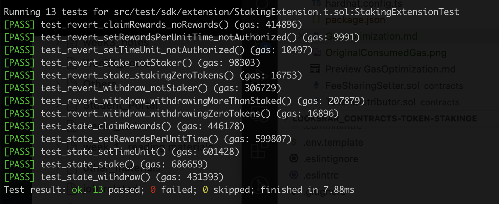
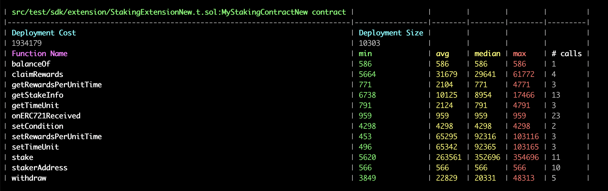

## GAS OPTIMAL LIST

1. **Deployment gas cost vs Runtime gas cost**
    * For the Staking721New contract, the user should interact with contract should more frequently, at least much greater than 20. So just changed it to   `{ enabled: true, runs: 200 }.`

2. All error string were changed to the custom error type meanwhile ReentrancyGuard using new version, visibility for stakingToken add immutable.
    
    ```
    // error
    error ZeroAddressForStakingToken(); // "collection address 0"

    error UnAuthorized();               // Not authorized

    error TimeUnitUnchanged();          // Time-unit unchanged 
    
    error RewardUnchanged();            // Reward unchanged

    error StakingZeroTokens();          //  "Staking 0 tokens"

    error WithdrawingZeroTokens();      // Withdrawing 0 tokens
    
    error WithdrawingMoreThanStaked(); // Withdrawing more than staked

    error NotStaker();                  // Not staker

    error NoRewards();                  // No rewards

    error ZeroTimeUint();               // time-unit can't be 0


    address public stakingToken;        ==> address public immutable stakingToken; 
    
    ```   

**Gas Cost Beginning**
 ***Not including balanceOf() / setCondition()***


**Gas Cost build on above change**

 
 **Gas cost for All functions and deployed  have reduced**